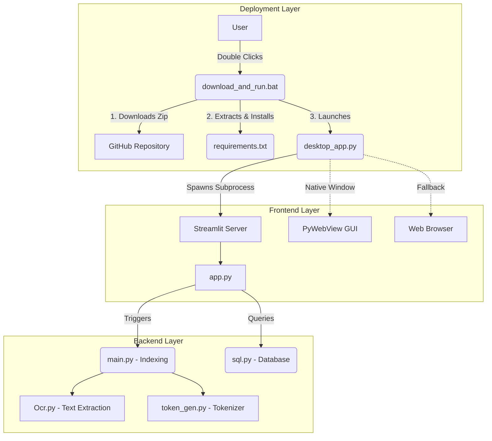
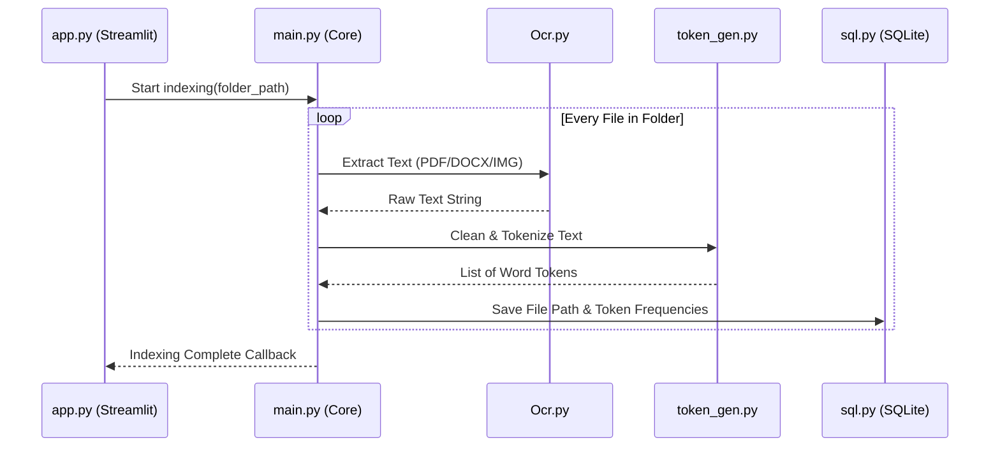
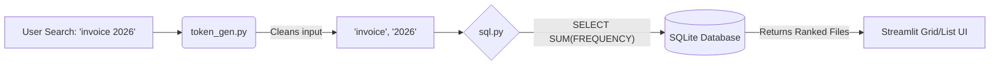

# 🔍 Local File Search 

A high-performance, locally hosted desktop search engine that indexes and retrieves your documents (PDF, Word, Text, and Images) instantly. It utilizes a custom SQLite indexing system, Optical Character Recognition (OCR), and a sleek Streamlit-based Dark Mode UI.

---

## 🌟 Key Features
- **Lightning Fast Search**: Uses tokenized SQLite databases instead of brute-force text scanning.
- **Universal Format Support**: Extracts text from `.txt`, `.pdf`, `.docx`, and even images (`.jpg`, `.png`) via Tesseract OCR.
- **Native Desktop Experience**: Wraps the web-based Streamlit UI into a standalone Windows application using PyWebView.
- **Graceful Fallbacks**: Automatically falls back to the user's default web browser if native dependencies fail.
- **Automated Deployment**: A tiny `download_and_run.bat` script acts as a stub installer, grabbing the latest version directly from GitHub.

---

## 🏗️ High-Level System Architecture

The application is split into three core layers: the **Deployment Layer**, the **Frontend Presentation Layer**, and the **Backend Indexing Engine**.

---

## 🔄 Data Workflows

How does the data move through the system when you index a folder and when you search?

### 1. The Indexing Flow (Ingestion)

When a user selects a folder to index, the system systematically extracts, tokenizes, and saves the text data into the database.

### 2. The Search Flow (Retrieval)

When a user types a query into the search bar, the system skips scanning the actual files and directly queries the pre-calculated token tables.

---

## 🗄️ Database Schema

The SQLite database (`file_id.db`) is highly optimized. Instead of storing the massive text content of every file, it only stores word frequencies.

| Table Name | Purpose | Key Columns |
|------------|---------|-------------|
| **`FILE_ID`** | Maps a unique integer ID to the file's absolute path. | `id` (PK), `FILENAME` (Absolute Path) |
| **`INDEXING`** | Maps individual words to the files they appear in. | `WORD`, `FILE_ID` (FK), `FREQUENCY` (Count) |

*By joining these two tables, the search engine instantly calculates the "Word Frequency" score for any given search query.*

---

## 📂 Component Breakdown

### 🖥️ 1. Deployment Scripts
- **`download_and_run.bat`**: A lightweight stub installer. It uses Windows built-in `curl` and `tar` to download the repo from GitHub, sets up the Python environment, installs dependencies, and creates a Desktop shortcut.
- **`desktop_app.py`**: A wrapper that boots up Streamlit headlessly on port `8501`. It attempts to use `pywebview` for a native application feel, but dynamically falls back to `webbrowser.open()` if the user's Python version lacks the C++ `.NET` build tools required for `pythonnet`.

### 🎨 2. User Interface
- **`app.py`**: The Streamlit frontend. Configured entirely in Dark Mode (via `.streamlit/config.toml`). It features:
  - Custom CSS for smooth, 30px pill-shaped search bars.
  - Native Windows folder selection (`tkinter.filedialog`).
  - Real-time progress bars connected via callbacks to the indexing engine.
  - Google Material SVG icons for different file types.

### ⚙️ 3. Core Engine
- **`main.py`**: The orchestration file. Handles the loop that reads a directory and pushes text to the tokenizer and database.
- **`sql.py`**: Handles all SQLite connections (`check_same_thread=False`). Contains logic for adding files, updating word frequencies, and executing the complex `JOIN` statements used for searching.
- **`Ocr.py`**: The text extraction hub. Uses `fitz` (PyMuPDF) for PDFs, `docx` for Word documents, and `pytesseract` for images. It features dynamic path resolution to safely skip image OCR if Tesseract is not installed on the host machine.
- **`token_gen.py`**: A simple NLP script that strips punctuation, applies lowercase, and breaks paragraphs into individual word tokens.
